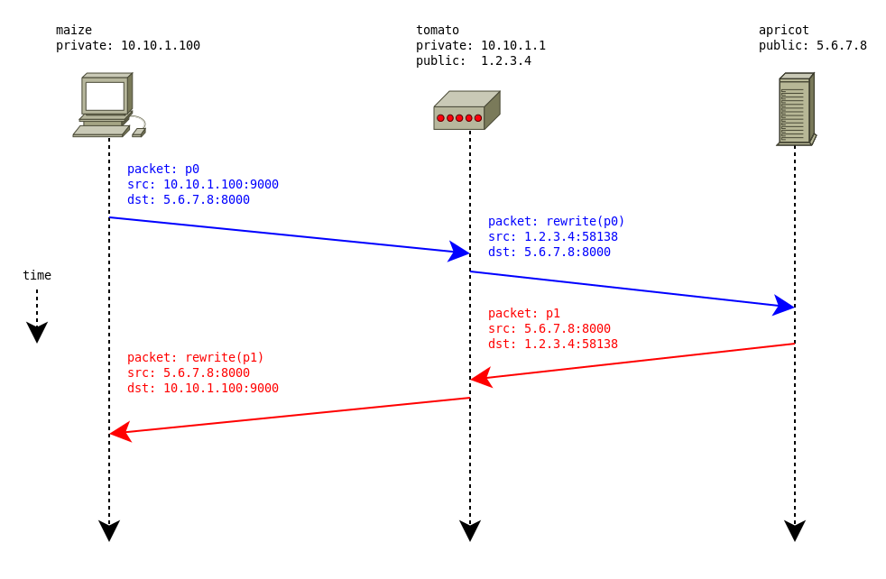

% Aeron For The Working Programmer
% Mark Raynsford
% 2018-03-28T10:39:05+0000

[Aeron](https://github.com/real-logic/Aeron) is an ultra-efficient
message transport library for Java and C++. It is designed to work
over unreliable media protocols such as UDP and Infiniband, and offers
ordered messaging and optional reliability (by retransmission of
messages in the case of dropped packets). The design and implementation
has an extreme emphasis on low-latency communication, making the
library ideal for use in applications with realtime requirements such
as fast-paced networked multiplayer games, high frequency financial
trading, VOIP, video streaming, etc. In particular, the Java implementation
is designed such that it will produce no garbage during steady state
execution, reducing memory pressure and work for the collector.

This guide is an attempt to describe how to put together a working
server that can serve a number of clients concurrently. It is
somewhat biased towards the perspective of a developer using Aeron
as the networking component of a client/server multiplayer game
engine. Specifically, the intention is that the described server
configuration will serve a relatively small number of clients
(typically less than a hundred) concurrently as opposed to serving
the tens of thousands of clients concurrently that might be expected
of a high-performance web server [^connect_limit].

This guide is intended to supplement the existing [Java programming guide](https://github.com/real-logic/aeron/wiki/Java-Programming-Guide).
Familiarity with networking and UDP sockets is assumed, but no prior
experience with Aeron is assumed. See the following documents for
details:

  * [Java programming guide](https://github.com/real-logic/aeron/wiki/Java-Programming-Guide)
  * [Aeron protocol specification](https://github.com/real-logic/aeron/wiki/Protocol-Specification)
  * [Aeron design overview](https://github.com/real-logic/aeron/wiki/Design-Overview)

# Concepts

## Publications And Subscriptions

The Aeron library works with unidirectional streams of messages known
as _publications_ and _subscriptions_. Intuitively, a _publication_
is a stream of messages to which you can _write_, and a _subscription_
is a stream of messages from which you can _read_. This requires a
slight adjustment in the way one would usually think about programming
within the context of, say, UDP sockets. UDP sockets are bidirectional;
the programmer will usually create a UDP socket, bind it to a local
address, and then read from that socket to receive datagrams,
and write datagrams to that same socket to send messages to peers. Aeron,
in contrast, requires the programmer to create separate pairs of
publications and subscriptions to write and read messages to and from
peers.

## Media Driver

Aeron defines a protocol on top of which the user is expected
to implement their own application-specific message protocol. The Aeron
protocol handles the details of message transmission, retransmission,
ordering, fragmentation, etc, leaving the application free to send
whatever messages it needs without having to worry about ensuring
those messages actually arrive and arrive in the right order.

The actual low-level handling of the transmission medium (such as
UDP sockets) is handled by a module of code known as the _media
driver_. The media driver can be either run standalone as a separate
process, or can be embedded within the application. For the examples
presented in this guide, we assume that the media driver will be
embedded within the application and, therefore, the application is
responsible for configuring, starting up, and shutting down the media
driver correctly.

# A Client And Server (Take 1) {#client_server_take_1}

As a first step, we'll write a trivial `echo` server and client:
Clients can connect to the server and send UTF-8 strings, and the
server will send them back. More formally, the client will:

[client_protocol]:

  1. Send an initial string `HELLO <port>`, where `<port>` is
     an unsigned decimal integer indicating the port to which
     responses from the server should be sent.

  2. If the initial `HELLO` string has been sent, the client will
     send an infinite series of arbitrary unsigned 32-bit decimal
     integers encoded as UTF-8 strings, one string per second.

The server will:

[server_protocol]:

  1. Wait for a client to connect and then read the initial `HELLO <port>`
     message.

  2. For each connected client `c`, the server will read a string `s`
     from `c` and then send back the exact same string `s` to the
     source address of `c` and the port `p` that `c` specified in its
     initial `HELLO` string.

We'll step through the simplest possible implementation that can work,
and then critically assess it with an eye to producing a second, better
implementation. No attempt will be made to produce efficient code:
We are, after all, sending UTF-8 strings as messages; There _will_
be allocations! For this example code, if any choice must be made
between efficiency, correctness, or simplicity, simplicity will be
chosen every time.

In order to write a server, the following steps are required:

  1. Start up the media driver.
  2. Create a subscription that will be used to read messages from
     clients.
  3. Go into a loop, creating new publications/subscriptions for clients
     as they connect, and reading/writing messages from/to existing
     clients.

In order to write a client, the following steps are required:

  1. Start up the media driver.
  2. Create a publication that will be used to send messages to
     the server.
  3. Go into a loop, sending messages to the server and reading
     back the responses.

For the sake of simplicity, we'll write the client first. All of
the code presented here is available as a Maven project on
[GitHub](https://github.com/io7m/aeron-guide), but excerpts will
be printed here for explanatory purposes.

## Echo Client

We start by defining an `EchoClient` class with a static `create`
method that initializes a media driver and an instance of the Aeron
library to go with it. The media driver requires a directory on the
filesystem within which it creates various temporary files that
are memory-mapped to allow efficient thread-safe communication
between the separate components of the library. For best results,
this directory should reside on a memory-backed filesystem (such as
`/dev/shm` on Linux), but this is not actually required.

The `create` method we define simply creates and launches Aeron and
the media driver. It also takes the local address that the client
will use for communication, and the address of the server to which
the client will connect. It passes these addresses on to the
constructor for later use.

[EchoClient.create()](https://github.com/io7m/aeron-guide/blob/f967e09d36ec8c7f525a66ade2f6f00ab43dcd51/src/main/java/com/io7m/aeron_guide/take1/EchoClient.java#L71)
```{include=out/echo_client_create.txt}
```

The various `Context` types contain a wealth of configuration options.
For the sake of this example, we're only interested in setting the
directory locations and will otherwise use the default settings.

Because the `EchoClient` class is the one responsible for starting
up the media driver, it's also responsible for shutting down the
media driver and Aeron when necessary. It implements the standard
`java.io.Closeable` interface and does the necessary cleanup in the
`close` method.

[EchoClient.close()](https://github.com/io7m/aeron-guide/blob/f967e09d36ec8c7f525a66ade2f6f00ab43dcd51/src/main/java/com/io7m/aeron_guide/take1/EchoClient.java#L239)
```{include=out/echo_client_close.txt}
```

Now we need to define a simple (blocking) `run` method that attempts to
connect to the server and then goes into an infinite loop sending
and receiving messages. For the sake of producing readable output, we'll
limit to polling for messages once per second. In real applications
with low-latency requirements, this would obviously be completely
counterproductive and a more sensible delay would be used [^poll]. The
method is constructed from several parts, so we'll define each of
those as their own methods and then compose them at the end.

Firstly, we need to create a _subscription_ that will be used to receive messages from the
remote server. This is somewhat analogous, for those familiar with
UDP programming, to opening a UDP socket and binding it to a local
address and port. We create the subscription by constructing a
[channel URI](https://github.com/real-logic/aeron/wiki/Channel-Configuration)
based on the local address given in the `create` method. We use
the convenient `ChannelUriStringBuilder` class to create a URI
string specifying the details of the subscription. We state that
we want to use `udp` as the underlying transport, and that we want
the channel to be _reliable_ (meaning that lost messages will be
retransmitted, and messages will be delivered to the remote side
in the order that they were sent). We also specify a
[stream ID](https://github.com/real-logic/aeron/wiki/Protocol-Specification#stream-setup)
when creating the subscription. Aeron is capable of multiplexing
several independent _streams_ of messages into a single connection.
It's therefore necessary for the client and server to agree on
a stream ID that will be used for communcation. In this case we
simply pick an arbitrary value of `0x2044f002`, but any non-zero
32-bit unsigned value can be used; the choice is entirely up to
the application.

[EchoClient.setupSubscription()](https://github.com/io7m/aeron-guide/blob/f967e09d36ec8c7f525a66ade2f6f00ab43dcd51/src/main/java/com/io7m/aeron_guide/take1/EchoClient.java#L226)
```{include=out/echo_client_setup_sub.txt}
```

If, for this example, we assume a client at `10.10.1.100` using a
local port `8000`, the resulting channel URI will look something like:

```
aeron:udp?endpoint=10.10.1.100:8000|reliable=true
```

We then create a _publication_ that will be used to send messages
to the server. The procedure for creating the publication is very
similar to that of the _subscription_, so the explanation won't be
repeated here.

[EchoClient.setupPublication()](https://github.com/io7m/aeron-guide/blob/f967e09d36ec8c7f525a66ade2f6f00ab43dcd51/src/main/java/com/io7m/aeron_guide/take1/EchoClient.java#L213)
```{include=out/echo_client_setup_pub.txt}
```

If, for this example, we assume a server at `10.10.1.200` using a
local port `9000`, the resulting channel URI will look something like:

```
aeron:udp?endpoint=10.10.1.200:9000|reliable=true
```

We now define a `runLoop` method that takes a created publication
and subscription and simply loops forever, sending and receiving
messages.

[EchoClient.runLoop()](https://github.com/io7m/aeron-guide/blob/f967e09d36ec8c7f525a66ade2f6f00ab43dcd51/src/main/java/com/io7m/aeron_guide/take1/EchoClient.java#L131)
```{include=out/echo_client_run_loop.txt}
```

The method first creates a buffer that will be used to store incoming
and outgoing data. Some of the ways in which Aeron achieves a very
high degree of performance include using native memory, allocating
memory up-front in order to avoid producing garbage during steady-state
execution, and eliminating buffer copying as much as is possible
on the JVM. In order to assist with this, we allocate a `2KiB` direct
byte buffer (with `16` byte alignment) to store messages, and use
the `UnsafeBuffer` class from Aeron's associated data structure
package [Agrona](https://github.com/real-logic/Agrona) to get very
high-performance (unsafe) memory operations on the given
buffer.

The method then sends a string `HELLO <port>` where `<port>` is
replaced with the port number used to create the _subscription_
earlier. The server is required to address responses to this port
and so those will be made available on the _subscription_ that the
client opened.

The method then loops forever, polling the subscription for new
messages, and sending a random integer string to the publication,
waiting for a second at each iteration.

The `sendMessage` method is a more-or-less uninteresting utility
method that simply packs the given string into the buffer we allocated
at the start of the method. It does not do any particular error handling:
Message sending can fail for the reasons given in the documentation
for the `Publication.offer()` method, and real applications should do the
appropriate error handling [^overflow]. Our implementation simply tries to write
a message, retrying up to five times in total, before giving up.
The method returns `true` if the message was sent, and logs an
error message and returns `false` otherwise. Better approaches for
real applications are [discussed later](#weak_message_sending_not_robust).

[EchoClient.sendMessage()](https://github.com/io7m/aeron-guide/blob/f967e09d36ec8c7f525a66ade2f6f00ab43dcd51/src/main/java/com/io7m/aeron_guide/take1/EchoClient.java#L185)
```{include=out/echo_client_send_message.txt}
```

The `poll` method, defined on the `Subscription` type, takes a
function of type `FragmentHandler` as an argument. In our case,
we pass an Aeron-provided implementation of the `FragmentHandler`
type called `FragmentAssembler`.  The `FragmentAssembler` class
handles the reassembly of fragmented messages and then passes the
assembled messages to our own `FragmentHandler` (in this case,
the `onParseMessage` method). Our code is extremely unlikely
to ever send or receive a message that could have exceeded the
[MTU](https://en.wikipedia.org/wiki/Maximum_transmission_unit) of
the underlying UDP transport. If it does happen, the
`FragmentAssembler` takes care of it.

[EchoClient.onParseMessage()](https://github.com/io7m/aeron-guide/blob/f967e09d36ec8c7f525a66ade2f6f00ab43dcd51/src/main/java/com/io7m/aeron_guide/take1/EchoClient.java#L173)
```{include=out/echo_client_on_parse_message.txt}
```

Now that we have all of the required pieces, the `run` method is
trivial:

[EchoClient.run()](https://github.com/io7m/aeron-guide/blob/f967e09d36ec8c7f525a66ade2f6f00ab43dcd51/src/main/java/com/io7m/aeron_guide/take1/EchoClient.java#L121)
```{include=out/echo_client_run.txt}
```

This is the bare minimum that is required to have a working client. For
ease of testing, a simple `main` method can be defined that takes
command line arguments:

[EchoClient.main()](https://github.com/io7m/aeron-guide/blob/f967e09d36ec8c7f525a66ade2f6f00ab43dcd51/src/main/java/com/io7m/aeron_guide/take1/EchoClient.java#L246)
```{include=out/echo_client_main.txt}
```

## Echo Server

The design of the server is not radically different to that of the
client. The main differences are in when and where publications
and subscriptions are created. The client simply opens a
publication/subscription pair to the only peer with which it will
communicate (the server) and maintains them until the user has had
enough. The server, however, needs to create publications and/or
subscriptions in response to clients connecting, and needs to be able
to address clients individually in order to send responses.

We structure the `EchoServer` server similarly to the `EchoClient`
including the static `create` method that sets up Aeron and the
media driver. The only difference is that the server does not have
a _remote address_ as part of its configuration information; it only
specifies a local address to which clients will connect.

The `run` method, however, is different in several aspects.

[EchoServer.setupSubscription()](https://github.com/io7m/aeron-guide/blob/f967e09d36ec8c7f525a66ade2f6f00ab43dcd51/src/main/java/com/io7m/aeron_guide/take1/EchoServer.java#L301)
```{include=out/echo_server_setup_sub.txt}
```

The _subscription_ configured by the server is augmented with
a pair of _image_ handlers. An _image_, in Aeron terminology, is
the replication of a _publication_ stream on the _subscription_ side.
In other words, when a client creates a _publication_ to talk to
the server, the server obtains an _image_ of the client's _publication_
that contains a _subscription_ from which the server can read. When
the client writes a message to its _publication_, the server can
read a message from the _subscription_ in the _image_.

When an _image_ becomes available, this is our indication that a
client has connected. When an _image_ becomes unavailable, this is
our indication that a client has disconnected.

We provide the subscription with pair of method references,
`this::onClientConnected` and `this::onClientDisconnected`, that
will be called when an _image_ becomes available and unavailable,
respectively.

[EchoServer.onClientConnected()](https://github.com/io7m/aeron-guide/blob/f967e09d36ec8c7f525a66ade2f6f00ab43dcd51/src/main/java/com/io7m/aeron_guide/take1/EchoServer.java#L331)
```{include=out/echo_server_on_client_connected.txt}
```

When an _image_ becomes available, we take note of the _session ID_
of the _image_. This can be effectively used to uniquely identify a
client with respect to that particular _subscription_. We create a
new instance of a `ServerClient` class used to store per-client state
on the server, and store it in map associating _session IDs_ with
`ServerClient` instances. The details of the `ServerClient` class
will be discussed shortly.

Similarly, in the `onClientDisconnected` method, we find the
client that appears to be disconnecting using the _session ID_ of
the _image_, call the `close` method on the corresponding
`ServerClient` instance, assuming that one exists, and remove
`ServerClient` instance from the table of clients.

[EchoServer.onClientDisconnected()](https://github.com/io7m/aeron-guide/blob/f967e09d36ec8c7f525a66ade2f6f00ab43dcd51/src/main/java/com/io7m/aeron_guide/take1/EchoServer.java#L318)
```{include=out/echo_server_on_client_disconnected.txt}
```

The server does not create a _publication_ in the `run` method
as the client did: It defers the creation of _publications_
until clients have connected for reasons that will be discussed
shortly.

The complete `run` method, therefore, looks like this:

[EchoServer.run()](https://github.com/io7m/aeron-guide/blob/f967e09d36ec8c7f525a66ade2f6f00ab43dcd51/src/main/java/com/io7m/aeron_guide/take1/EchoServer.java#L224)
```{include=out/echo_server_run.txt}
```

The `runLoop` method on the server is simplified when compared
to the analogous method on the client. The method simply polls
the main subscription repeatedly:

[EchoServer.runLoop()](https://github.com/io7m/aeron-guide/blob/f967e09d36ec8c7f525a66ade2f6f00ab43dcd51/src/main/java/com/io7m/aeron_guide/take1/EchoServer.java#L232)
```{include=out/echo_server_run_loop.txt}
```

The main difference is the work that now takes place in the `onParseMessage`
method:

[EchoServer.onParseMessage()](https://github.com/io7m/aeron-guide/blob/f967e09d36ec8c7f525a66ade2f6f00ab43dcd51/src/main/java/com/io7m/aeron_guide/take1/EchoServer.java#L248)
```{include=out/echo_server_on_parse_message.txt}
```

We first take the _session ID_ provided to us by the `Header` value
passed to us by Aeron. The _session ID_ is used to look up a client
in the table of clients populated by the `onClientConnected` method.
Assuming that a client actually exists with a matching _session ID_,
a UTF-8 string is decoded from the buffer as it is in the `EchoClient`
implementation, but the decoded string is then given to the corresponding
`ServerClient` instance to be processed via its `onReceiveMessage`
method.

Due to the small size of the `ServerClient` class (it effectively
only contains a single method that does interesting work), the code
is published here in its entirety:

[EchoServer.ServerClient](https://github.com/io7m/aeron-guide/blob/f967e09d36ec8c7f525a66ade2f6f00ab43dcd51/src/main/java/com/io7m/aeron_guide/take1/EchoServer.java#L63)
```{include=out/echo_server_server_client.txt}
```

The `ServerClient` class maintains a `State` field which may either be
`CONNECTED` or `INITIAL`. The client begins in the `INITIAL` state and
then transitions to the `CONNECTED` state after successfully processing
the `HELLO` string that is [expected to be sent by connecting clients
as their first message](#client_server_take_1). The `onReceiveMessage`
method checks to see if the client is in the `INITIAL` state or
the `CONNECTED` state. If the client is in the `INITIAL` state,
the message is passed to the `onReceiveMessageInitial` method.
This method parses what it assumes will be a `HELLO` string and
constructs a new _publication_ that will be used to send messages back
to the client. Aeron provides us with both the source address of the
client and the ephemeral port the client used to send the message we
just received via the `Image.sourceIdentity()` method. However, we
cannot send messages back to the ephemeral port the client used: We
need to send messages to the port the client specified in the `HELLO`
message so that they are readable via the _subscription_ the client
created in `EchoClient.setupSubscription()` for that purpose.

When using UDP as a transport, the result of the `sourceIdentity()`
call will be a string of the form `ip-address:port`. For a client at
`10.10.1.200` using an arbitrary high-numbered ephemeral UDP port, the
string may look something like `10.10.1.200:53618`. The simplest way
to parse a string of this form is to simply delegate parsing to the standard
`java.net.URI` class. We do this by constructing a URI containing the
original address and port [^fake_uri], extracting the IP address from the resulting
`URI` value, substituting the port specified by the client in the
`HELLO` string, and then opening a new _publication_ in a way that
should now be familiar.

Assuming that all of this proceeds without issue, the client is moved
to the `CONNECTED` state and the method returns. From that point on,
any message received by that particular client instance will be sent
back to the client via the newly created _publication_.

At this point, we appear to have a working client and server. An
additional `main` method is added to the server to help with testing
from the command line:

[EchoServer.main()](https://github.com/io7m/aeron-guide/blob/f967e09d36ec8c7f525a66ade2f6f00ab43dcd51/src/main/java/com/io7m/aeron_guide/take1/EchoServer.java#L349)
```{include=out/echo_server_main.txt}
```

Executing the server and a client from the command line produces the expected output:

```
server$ java -classpath target/com.io7m.aeron-guide-0.0.1.jar com.io7m.aeron_guide.take1.EchoServer /tmp/aeron-server 10.10.1.100 9000
20:26:47.070 [main] DEBUG com.io7m.aeron_guide.take1.EchoServer - subscription URI: aeron:udp?endpoint=10.10.1.100:9000|reliable=true
20:28:09.981 [aeron-client-conductor] DEBUG com.io7m.aeron_guide.take1.EchoServer - onClientConnected: 10.10.1.100:44501
20:28:10.988 [main] DEBUG com.io7m.aeron_guide.take1.EchoServer - receive [0x896291375]: HELLO 8000
20:28:11.049 [main] DEBUG com.io7m.aeron_guide.take1.EchoServer - receive [0x896291375]: 2745822766
20:28:11.050 [main] DEBUG com.io7m.aeron_guide.take1.EchoServer - send: [session 0x562238613] 2745822766
20:28:11.953 [main] DEBUG com.io7m.aeron_guide.take1.EchoServer - receive [0x896291375]: 1016181810
20:28:11.953 [main] DEBUG com.io7m.aeron_guide.take1.EchoServer - send: [session 0x562238613] 1016181810
20:28:12.955 [main] DEBUG com.io7m.aeron_guide.take1.EchoServer - receive [0x896291375]: 296510575
20:28:12.955 [main] DEBUG com.io7m.aeron_guide.take1.EchoServer - send: [session 0x562238613] 296510575
20:28:13.957 [main] DEBUG com.io7m.aeron_guide.take1.EchoServer - receive [0x896291375]: 3276793170
20:28:13.957 [main] DEBUG com.io7m.aeron_guide.take1.EchoServer - send: [session 0x562238613] 3276793170

client$ java -classpath target/com.io7m.aeron-guide-0.0.1.jar com.io7m.aeron_guide.take1.EchoClient /tmp/aeron-client0 10.10.1.100 8000 10.10.1.100 9000
20:28:09.826 [main] DEBUG com.io7m.aeron_guide.take1.EchoClient - subscription URI: aeron:udp?endpoint=10.10.1.100:8000|reliable=true
20:28:09.846 [main] DEBUG com.io7m.aeron_guide.take1.EchoClient - publication URI: aeron:udp?endpoint=10.10.1.100:9000|reliable=true
20:28:10.926 [main] DEBUG com.io7m.aeron_guide.take1.EchoClient - send: HELLO 8000
20:28:10.927 [main] DEBUG com.io7m.aeron_guide.take1.EchoClient - send: 2745822766
20:28:11.928 [main] DEBUG com.io7m.aeron_guide.take1.EchoClient - send: 1016181810
20:28:11.933 [main] DEBUG com.io7m.aeron_guide.take1.EchoClient - response: 2745822766
20:28:12.934 [main] DEBUG com.io7m.aeron_guide.take1.EchoClient - send: 296510575
20:28:12.934 [main] DEBUG com.io7m.aeron_guide.take1.EchoClient - response: 1016181810
20:28:13.935 [main] DEBUG com.io7m.aeron_guide.take1.EchoClient - send: 3276793170
20:28:13.935 [main] DEBUG com.io7m.aeron_guide.take1.EchoClient - response: 296510575
```

The implementation works, but suffers from a number of weaknesses ranging from
benign to potentially fatal.

## Implementation Weaknesses

### EchoClient Server Disconnections {#weak_client_disconnections}

The `EchoClient` implementation does not handle the case of the server
either disconnecting or not existing in the first place. It will simply
try to send messages forever and will ignore the fact that it never
gets a response. Handling this was deliberately left out of the implementation
for the sake of keeping the code as simple as possible. The way to
fix this is twofold.

Firstly, the client can simply give up trying to send the initial
`HELLO` message if no response has been received after a reasonable
amount of time has elapsed. This solution can work well for protocols
where the first message in the conversation is expected to be sent
by the client. Aeron also indicates when a `Publication` is no longer
connected by returning `NOT_CONNECTED` or `CLOSED` when calling `offer()`
on the `Publication`. Real applications can react accordingly rather than
just logging a failure message (like the `EchoClient` and `EchoServer`) and
continuing.

Secondly, the client can specify _image handlers_ on the _subscription_
it creates in the same manner as the server. When an _image_ becomes
available, that means that the server has sent a message and is therefore
presumably alive and willing to talk to the client. When an _image_
becomes unavailable, the server is no longer willing or able to
talk to the client. This can work well for protocols where the first
message in the conversation is expected to be sent by the server.

### MTU Handling Is Implicit {#weak_mtu}

Sending messages over the open internet imposes an upper bound on
the [MTU](https://en.wikipedia.org/wiki/Maximum_transmission_unit)
that an application can use for individual messages.

As a general rule of thumb, the `MTU` for UDP packets sent over
the open internet should be `<= 1200` bytes. Aeron adds the further
restriction that `MTU` values must be a multiple of `32`.

The `EchoClient` and `EchoServer` implementations use UTF-8 strings
that are not expected to be longer than about `16` bytes, and so
assume that fragmentation will never occur and make no attempt to
avoid it.

### Clients Sending Bad Messages Are Not Killed {#weak_client_bad_messages}

The `EchoServer` implementation has a rather serious failing in
that if the first message received by a client is not parseable
as a simple `HELLO <port>` string, the offending client will
never be told about this and the server will continue to process
every subsequent message from the client as if it was an unparseable
`HELLO` string.

This is partly a result of an underspecification of the protocol:
The server has no way to tell a client that a fatal error has occurred
and that the client should go away (or at least retry the `HELLO`
string). This is also an implementation issue: The server has no
means to forcibly disconnect a client (and as discussed previouly,
the client would not notice that it had been disconnected anyway).

### Message Sending Is Not Robust {#weak_message_sending_not_robust}

The way that messages are sent is insufficient in the sense that a
failure to send a message is not a hard error. Real applications must
be prepared to queue and retry messages as necessary, and should raise
exceptions if messages absolutely cannot be sent after a reasonable
number of attempts.

See [Handling Back Pressure](https://github.com/real-logic/aeron/wiki/Java-Programming-Guide#handling-back-pressure)
for details.

### Work Takes Place On Aeron Threads {#weak_thread}

Currently, all work takes place on threads controlled by Aeron. As
per the documentation, `Publication` values are thread-safe, and
`Subscription` values are not. Real applications should expect to
take messages from a `Subscription` and place them into a queue
for processing by one or more application threads [^disruptor] to
avoid blocking the Aeron conductor threads. See [Thread Utilisation](https://github.com/real-logic/aeron/wiki/Thread-Utilisation)
for details.

### EchoClient Cannot Be Behind NAT {#weak_nat}

This is the most serious issue with the implementation described
so far (and astute programmers familiar with UDP networking will
already have noticed): The implementation is fundamentally incompatible
with [Network Address Translation](https://en.wikipedia.org/wiki/Network_address_translation).

The server must be able to open connections directly to clients, and
this is something that is not possible without clients enabling port
forwarding on the NAT routers that they are inevitably sitting behind.
The same is true of connections opened to the server by the clients,
but this is less of an issue in that server operators are used to
routinely enabling port forwarding on their routers to allow clients
to connect in. For a multiplayer game with non-technical players
running clients on the open internet, requring each client to enable
port forwarding just to be able to connect to a server would be
unacceptable.

Additionally, having clients specify port information in an
application-level protocol is distasteful. Anyone familiar with
UDP programming can open a socket, bind it, and then read and write
datagrams without even thinking about NAT: Routers will statefully
match inbound datagrams to previously sent outbound datagrams and
allow them to pass through unheeded. It seems unpleasant that Aeron
would require us to give up this essentially OS-level functionality.
Thankfully, Aeron includes a somewhat sparsely documented feature
known as [multi-destination-cast](https://github.com/real-logic/aeron/wiki/Protocol-Specification#multi-destination-cast-mode-of-operation)
that can be used to traverse NAT systems reliably, removing the
requirement for servers to connect directly back to clients.

# A Client And Server (Take 2) {#client_server_take_2}

The serious issue that needs to be fixed with our implementation is
the lack of ability to function with clients behind NAT. In order to
handle this, we need to use a feature of Aeron known as
_multi-destination-cast_ (MDC). At first glance, this would appear to have
nothing whatsoever to do with NAT: Essentially, it is a means to
broadcast messages to a set of clients using only unicast UDP
(as opposed to [multicast UDP](https://en.wikipedia.org/wiki/Multicast),
which may or may not be available on the open internet). However, as
will now be demonstrated, we can actually use MDC to get reliable
NAT traversal.

## Multi-Destination-Cast

To understand how _multi-destination-cast_ solves our problem,
consider what happens with a traditional non-Aeron program that uses
UDP sockets to send datagrams directly:



The client machine `maize` has a private address `10.10.1.100` and
sits behind a stateful packet filter and NAT router `tomato`. `tomato`
has a private address of `10.10.1.1` and a public address `1.2.3.4`.
The server `apricot` has a public address of `5.6.7.8`. The operating
system on `tomato` is performing unidirectional NAT: The source addresses of
packets sent outbound (from left to right on the diagram) from the
private network `10.10.*` will be rewritten so that they appear to
be coming from the public address `1.2.3.4`.

1. `maize` opens a UDP socket and binds it to `10.10.1.100:9000`,
    and then uses the socket to send a datagram `p0` to port `8000`
    on the server `apricot`.

2. The datagram `p0` reaches `tomato`, which dutifully performs
   network address translation on the packet. The source address of `p0`
   is rewritten to the public address of `tomato` and the source port
   is changed to an arbitrary high-numbered unused port, resulting in
   a packet `rewrite(p0)` with source `1.2.3.4:58138`. The operating
   system on `tomato` records the fact that this rewrite took place,
   and then sends `rewrite(p0)` on its way to `apricot`.

3. `apricot` receives `rewrite(p0)` and accepts it. A short time later,
   it sends a response packet `p1` back to the source of `rewrite(p0)`.

4. The packet `p1` reaches `tomato` and is inspected. The operating
   system on `tomato` sees that the packet has come from `5.6.7.8:8000`
   and is destined for `1.2.3.4:58138`, and notices that it recently saw
   an outgoing packet that was destined for `5.6.7.8:8000` and that it
   rewrote the source address to `1.2.3.4:58138`. It makes the assumption
   that this must be a packet sent in response to the packet it rewrote
   earlier, and so it rewrites the destination of `p1` to be equal to
   the original source of `p0` - `10.10.1.100:9000` - and sends it onward.

5. The rewritten packet, `rewrite(p1)`, is sent on its way and makes it safely to `maize`.

UDP is a connectionless protocol, but it's possible treat a stream
of datagrams as a "connection" by keeping track of the source
and destination addresses, and by remembering the recent address
rewrites. This is standard practice on all modern NAT implementations
and means that the vast majority of UDP applications can work correctly
when the clients are behind NAT.

The reason that our original `EchoClient` and `EchoServer`
implementation cannot work behind NAT is because first the client
sends a datagram `d0` to the server and then, based on the data
in the packet, the server then tries to send a new and completely
unrelated datagram `d1` back to the port that the client specified.
The NAT router obviously knows nothing of the application-level
protocol between the client and server and so it can't know about
the port agreed upon by the client and server. It will not have a
record of any recent rewrites that occurred for the port given in `d1`
(because none have occurred), and so the packet will simply be dropped
when it reaches the router. As mentioned previously, streams in Aeron
are strictly unidirectional and so we cannot construct an an object
(like a traditional UDP socket) that has both a single address and
port, and that can both receive and send messages.

Aeron's _multi-destination-cast_ feature allows subscribers to add
themselves as destinations to a _publication_ in a manner that will
work correctly when the subscribers are behind NAT. Essentially,
a _publication_ can declare an _explicit control port_ that clients
may use to register themselves as destinations for the _publication_.
The _publication_ will send data to all of the subscribers that have
registered, and the underlying protocol for this is implemented
such that the datagrams containing the messages written to the
_publication_ will be addressed to the _source adresses and ports_
of the subscribers. This allows the data packets to be treated as
ordinary response packets by NAT systems and, as such, they will
successfully reach subscribers without issue.

Briefly, a server at `5.6.7.8` could make these two calls:

```
// aeron:udp?endpoint=5.6.7.8:9000|control=5.6.7.8:9001|control-mode=dynamic|reliable=true

final ConcurrentPublication server_pub =
  aeron.addPublication(
    new ChannelUriStringBuilder()
      .media("udp")
      .reliable(TRUE)
      .controlEndpoint("5.6.7.8:9001")
      .controlMode("dynamic")
      .endpoint("5.6.7.8:9000")
      .build(),
    SOME_STREAM_ID);

// aeron:udp?endpoint=5.6.7.8:9000|reliable=true

final Subscription server_sub =
  aeron.addSubscription(
    new ChannelUriStringBuilder()
      .media("udp")
      .reliable(TRUE)
      .endpoint("5.6.7.8:9000")
      .build(),
    SOME_STREAM_ID,
    image -> LOG.debug("server: a client has connected"),
    image -> LOG.debug("server: a client has disconnected"));
```

The first call creates a _publication_ that listens for _subscriptions_
on `5.6.7.8:9000` and also creates a _control port_ on `5.6.7.8:9001`.
It specifies that it wants _dynamic_ MDC, which means that clients
will be automatically added to the _publication_ as destinations. In
contrast, specifying _manual_ mode here means that clients would need
to be explicitly added by calling `Publication.addDestination()`. The
created _publication_ is used to send messages to all clients. Note
that we specifically mean _all_ clients; we have no way to address
clients individually. This limitation will be addressed shortly.

The second call creates a _subscription_ on `5.6.7.8:9000` that will
be used to accept messages from clients. Note that although the
_publication_ and _subscription_ both share the same `5.6.7.8:9000`
endpoint, they are completely distinct streams: Messages written to
`server_pub` will not be accessible from `server_sub`.

In both cases, the server uses an arbitrary application-specific
_stream ID_ named `SOME_STREAM_ID`. The client will need to use the
same value.

Then, a client at `10.10.1.100` could make the following calls:

```
// aeron:udp?endpoint=5.6.7.8:9000|reliable=true

final ConcurrentPublication client_pub =
  aeron.addPublication(
    new ChannelUriStringBuilder()
      .media("udp")
      .reliable(TRUE)
      .endpoint("5.6.7.8:9000")
      .build(),
    SOME_STREAM_ID);

// aeron:udp?endpoint=10.10.1.100:8000|control=5.6.7.8:9001|control-mode=dynamic|reliable=true

final Subscription client_sub =
  aeron.addSubscription(
    new ChannelUriStringBuilder()
      .media("udp")
      .reliable(TRUE)
      .controlEndpoint("5.6.7.8:9001")
      .controlMode("dynamic")
      .endpoint("10.10.1.100:8000")
      .build(),
    SOME_STREAM_ID,
    image -> LOG.debug("client: connected to server"),
    image -> LOG.debug("client: disconnected from server"));
```

The first call creates a _publication_ that will send messages to
the server at `5.6.7.8:9000`.

The second call creates a _subscription_ that will create a local
socket at `10.10.1.100:8000` that will be used to receive messages from
the server, and will register itself dynamically as a destination by
contacting the _control socket_ on the server at `5.6.7.8:9001`. If
no local socket is specified here, the implementation will use an
arbitrary high-numbered ephemeral port on whatever local IP address
it thinks is appropriate.

As mentioned, one serious issue with the above is that the server only has
a single _publication_ that will send messages to all clients. This is
less than useful if the requirement is to implement a protocol like our
`echo` protocol where each client is supposed to have its own stream
of messages and responses. The current solution to this in Aeron is
to simply create multiple _publications_ and then somehow arrange
for each new connecting client to subscribe to a fresh _publication_
intended just for that client. We now need to redesign the `echo`
protocol to address this along with all of the other implementation
weaknesses discussed so far.

## Security Requirements {#threat_model}

We assume a threat model that matches that of the average authoritative
server-based (as opposed to _peer-to-peer_) online multiplayer game
as of 2018. That is:

  * Clients speak directly to the server and never with each other.
    Messages from anything other than the server's address must be
    ignored.

  * Client code is completely untrusted; clients may be running
    (possibly maliciously) modified code. We must assume that
    clients will send invalid messages to the server.

  * Clients can spoof packets such that their content can be
    arbitrary data and may appear to be coming from any address.

  * Clients cannot read packets sent by other clients to the server,
    and cannot read the packets sent by the server to other clients [^same_lan].

  * Malicious clients can and will try to take control of the server.
    Failing that, malicious clients can and will try to perform simple
    denial of service attacks on the server - just because they can.

## Echo 2.0 Outline

The rough outline for our new protocol is that a client will first
connect to the server and introduce itself. The server will then
allocate a new _publication_ and _subscription_ pair (that we term as a _duologue_) and
tell the client how to reach them. The client will disconnect and
then connect to the new _duologue_ and start
sending strings to be echoed as before. We'd like to add a way
for the server to signal errors to the client and, given that
we need to allocate new channels for each new client, we'd be
well-advised to place some sort of configurable limit on the
number of clients that can be connected at any given time [^connect_limit].

The right way to implement this appears to be to have a client
introduce itself to the server on an _all clients_ channel, and then
have the server redirect that client to a _publication_/_subscription_
pair allocated for that client alone.  The server broadcasts messages
on the _all clients_ channel and prefixes messages addressed to a
specific client with the _session ID_ of the target client.

When a client `c` subscribes to the _all clients_ channel, it is
assigned a (random) _session ID_ `s` by Aeron automatically. The
server allocates a new duologue `q`, and broadcasts a message that
the client with session `s` should open a _publication_ and _subscription_
to the port number of `q`.  The client then unsubscribes from the
_all clients_ channel and opens a _publication_ and _subscription_
to the port number of `q`. The client and server can then exchange
messages on a one-to-one basis via `q`, with the server deleting `q`
when the client disconnects.

Of course, a malicious client could simply create lots of _subscriptions_
to the _all clients_ channel and keep requesting new _duologues_ until
the server either runs out of available UDP ports or the maximum number
of clients for the server is reached. It's therefore necessary to simply
refuse to create more than `n` new _duologues_ for a client at any given
IP address. Of course, this raises a further issue: What if a client `c`
spoofs an endless stream of requests to create new duologues but does so
by spoofing the IP address of another client `d` in the requests? The
server will wrongfully punish `d` for the requests, and will in fact stop
`d` from being able to request its own _duologues_.

To combat both of these issues, the server will _expire_ a _duologue_
if no client has connected to it within a configurable time limit.
Of course, a malicious client could try to request the maximum number
of _duologues_ by spoofing requests and impersonating `d`, and could
then spoof further packets, connect to those _duologues_, and prevent
them from expiring. This would essentially lock `d` out of the server
for as long as the server continues running. This is difficult but not
impossible for a determined attacker to achieve. To combat this, the
server needs to make it difficult for anyone other than a well-behaved
client to actually connect to a requested _duologue_. Essentially, the
server must share a secret with a requesting client, and that client
must then present that same secret to the server when connecting to
the _duologue_.

The solution to this is fairly simple. The client sends a 4-byte
[one-time pad](https://en.wikipedia.org/wiki/One-time_pad) to the
server when it connects to the _all clients_ channel. By our intended
[threat model](#threat-model), only the server is capable of reading
this one-time pad. When the server creates a new _duologue_, it chooses
the _session ID_ for the _duologue_ ahead of time (rather than allowing
Aeron to pick one itself), encrypts this _session ID_ with the client's
one-time pad, and sends the encrypted ID as part of the response given
to the client when directing it to the new _duologue_. The client
decrypts the _session ID_ and then uses it when connecting to the
_duologue_. Aeron will automatically reject [^reject] any client that tries
to connect with an incorrect _session ID_; it's not necessary to
deal with invalid sessions at the application level.

In effect, this means that a malicious client that is trying to
interfere with the ability of another client to connect must:

  1. Listen for messages in the _all clients_ channel indicating
     that the server has just created a new _duologue_.

  2. Somehow guess the source IP address of the client that
     created the _duologue_. In the case of IPv4, this would
     involve guessing the right address from slightly more
     than `2 ^ 31` addresses.

  3. Somehow guess the required _session ID_. Identifiers are
     randomly selected from a pool of `2 ^ 31` possible values.

  4. Spoof enough packets implementing the underlying Aeron
     protocol to set up the required publication to the _duologue_,
     including the hard-to-guess _session ID_, and then spoof
     more packets to keep the connection alive.

This would appear to be next to impossible to achieve reliably. It
would be easier for the attacker to simply attempt some sort of
distributed denial-of-service attack (against which there is obviously
no protocol-level protection possible).

## Echo 2.0 Specification

All messages are UTF-8 encoded strings.

The client:

1. Must open a _publication_ `p` and a _subscription_ `s` to the server, using dynamic MDC on the _subscription_, and must send the string `HELLO <key>` where `<key>` is a random unsigned 32-bit hexadecimal value [^pad_fresh] encoded as a string.

2. Must wait until the server sends a _response string_ of either the form `<session> CONNECT <port> <control-port> <encrypted-session>` or `<session> ERROR <message>`.
  - If the response is of the form `<session> ERROR ...`, but `<session>` does not match the client's current _session ID_, the response should be ignored and the client should continue waiting.
  - If the response is of the form `<session> ERROR <message>` and `<session>` matches the the client's current _session ID_, the client must assume that `<message>` is an informative error message, log the message, and exit.
  - If the response is of the form `<session> CONNECT ...`, but `<session>` does not match the client's current _session ID_, the response should be ignored and the client should continue waiting.
  - If the response is of the form `<session> CONNECT <port> <control-port> <encrypted-session>` and  `<session>` matches the client's current _session ID_:
    - The client must decrypt `<encrypted-session>` by evaluating `k = <encrypted-session> ^ <key>`, where `<key>` is the value from step 1.
    - The client must create a _subscription_ `t` to port `<port>` on the server, using `<control-port>` for MDC and with an explicit _session ID_ `k`.
    - The client must create a _publication_ `u` to port `<port>` on the server with an explicit _session ID_ `k`.
    - The client must close `s` and `p`, and progress to step 3.
  - If the server fails to return an acceptable response in a reasonable amount of time, the client must log an error message and exit.

3. Must send messages of the form `ECHO <message>` to `u`, listening for responses on `t`.
  - If the response is of the form `ERROR <message>`, the client should assume that `<message>` is an informative error message, log the message, and exit.
  - If the response is of the form `ECHO <message>`, the client should assume that `<message>` is one of the strings it previously sent, and return to step 3.

The server:

1. Must open a _publication_ `p` that will be used to send initial messages to clients when they connect. It must provide a _control port_ so that clients can use dynamic MDC.

2. Must create a _subscription_ `s` that will be used to receive initial messages from clients.

The server stores an initially empty list of _duologues_. A _duologue_ is a structure
comprising the following state:

```
record Duologue(
  InetAddress owner,
  int session_id,
  Publication pub,
  Subscription sub);
```

When a message is received on `s`:

- If the message is of the form `HELLO <key>`
  - If the size of the list of _duologues_ is `n`:
    - The server must write a message of the form `<session-id> ERROR server full` to `p`, where `<session-id>` is the _session ID_ of the client that sent the message, and return to waiting for messages.
  - If there are at least `m` existing _duologues_ owned by the IP address of the client that sent the message, where `m` is a configurable value:
    - The server must write a message of the form `<session-id> ERROR too many connections for IP address` to `p`, where `<session-id>` is the _session ID_ of the client that sent the message, and return to waiting for messages.
  - Otherwise:
    - The server must record `(a, z, t, u)` into the list of _duologues_, where `t` and `u` are a freshly allocated _publication_ and _subscription_, respectively, `a` is the IP address of the client, and `z` is a freshly allocated _session ID_.
    - The server must write a message `<session-id> CONNECT <port> <control-port> <encrypted-session>` to `p`, where `<port>` and `<control-port>` are the port numbers of `t` and `u`, `<encrypted-session>` is `z ^ <key>`, and `<session-id>` is the _session ID_ of the client that sent the message.
    - The server must return to waiting for messages.

When message is received on the subscription `u` of a _duologue_ `i`:

- If the message is of the form `ECHO <message>`
  - The server must write a message of the form `ECHO <message>` to `t`.
- Otherwise:
  - The server must write a message of the form `ERROR bad message` to `t`.
  - The server must close `t` and `u`.
  - The server must delete the duologue.

Finally, the server should delete _duologues_ that have no subscribers after
the arbitrary configurable time limit has expired.

## Echo 2.0 Server

We start by examining the server implementation.

The `create` method is mostly unchanged. The main difference is that
we tell the _media driver_ that we are going to be manually assigning
_session IDs_ in the range `[EchoSessions.RESERVED_SESSION_ID_LOW,
EchoSessions.RESERVED_SESSION_ID_HIGH]` ourselves. When the _media
driver_ automatically assigns _session IDs_, it must use values outside
of this range to avoid conflict with any that we assign ourselves. We
also initialize a value of type `EchoServerExecutorService`.

[EchoServer.create()](https://github.com/io7m/aeron-guide/blob/f967e09d36ec8c7f525a66ade2f6f00ab43dcd51/src/main/java/com/io7m/aeron_guide/take2/EchoServer.java#L94)
```{include=out/echo_server2_create.txt}
```

As can be seen, the multiple parameters that were passed to the
`create()` method in the original implementation have been moved
into an immutable `EchoServerConfiguration` type. The
implementation of this type is generated automatically by the
[immutables.org](http://www.immutables.org) annotation processor.

[EchoServerConfiguration](https://github.com/io7m/aeron-guide/blob/f967e09d36ec8c7f525a66ade2f6f00ab43dcd51/src/main/java/com/io7m/aeron_guide/take2/EchoServerConfiguration.java#L9)
```{include=out/echo_server2_EchoServerConfiguration.txt}
```

The `EchoServerExecutorService` type is effectively a single-threaded
`java.util.concurrent.Executor` with some extra methods added
that code can use to check that it is indeed running on the correct
thread.  The class is used to ensure that long-running work is not
performed on threads owned by Aeron (addressing [the noted threading
issues](#weak_thread)), and to ensure that access to the server's
internal state is strictly single-threaded. The implementation of
this class is fairly unsurprising:

[EchoServerExecutorService](https://github.com/io7m/aeron-guide/blob/f967e09d36ec8c7f525a66ade2f6f00ab43dcd51/src/main/java/com/io7m/aeron_guide/take2/EchoServerExecutorService.java#L10)
```{include=out/echo_server2_executor_service.txt}
```

[EchoServerExecutor](https://github.com/io7m/aeron-guide/blob/f967e09d36ec8c7f525a66ade2f6f00ab43dcd51/src/main/java/com/io7m/aeron_guide/take2/EchoServerExecutor.java#L15)
```{include=out/echo_server2_executor.txt}
```

We litter the code with calls to `assertIsExecutorThread()` to help
catch thread misuse early.

The majority of the interesting work that the server does is now
performed by a static inner class called `ClientState`. This class
is responsible for accepting requests from clients, checking access
restrictions (such as enforcing the limit on _duologues_ by a single
IP address), polling existing _duologues_ for activity, and so on.
We establish a rule that access to the `ClientState` class is
confined to a single thread via the `EchoServerExecutor` type. The
`EchoServer` class defines three methods that each essentially
delegate to the `ClientState` class:

[EchoServer.onInitialClientConnected()](https://github.com/io7m/aeron-guide/blob/f967e09d36ec8c7f525a66ade2f6f00ab43dcd51/src/main/java/com/io7m/aeron_guide/take2/EchoServer.java#L316)
```{include=out/echo_server2_on_initial_client_connected.txt}
```

[EchoServer.onInitialClientDisconnected()](https://github.com/io7m/aeron-guide/blob/f967e09d36ec8c7f525a66ade2f6f00ab43dcd51/src/main/java/com/io7m/aeron_guide/take2/EchoServer.java#L331)
```{include=out/echo_server2_on_initial_client_disconnected.txt}
```

[EchoServer.onInitialClientMessage()](https://github.com/io7m/aeron-guide/blob/f967e09d36ec8c7f525a66ade2f6f00ab43dcd51/src/main/java/com/io7m/aeron_guide/take2/EchoServer.java#L260)
```{include=out/echo_server2_on_initial_client_message.txt}
```

The `onInitialClientConnected()` and `onInitialClientDisconnected()`
methods are called as _image handlers_ by the _subscription_ the
server configures for the _all clients_ channel. The
`onInitialClientMessage` method is called when a client sends
a message on the _all clients_ channel.

The `ClientState.onInitialClientConnectedProcess()` method does
the majority of the work required when a client requests the
creation of a new _duologue_:

[EchoServer.ClientState.onInitialClientConnectedProcess()](https://github.com/io7m/aeron-guide/blob/f967e09d36ec8c7f525a66ade2f6f00ab43dcd51/src/main/java/com/io7m/aeron_guide/take2/EchoServer.java#L400)
```{include=out/echo_server2_on_initial_client_message_process.txt}
```

The `ClientState.allocateNewDuologue()` method does the actual work of
_duologue_ allocation by allocating UDP port numbers, a _session ID_,
incrementing the number of _duologues_ assigned to the IP address
of the client, and then calling `EchoServerDuologue.create()` (which
does the actual work of creating the underlying Aeron _publications_
and _subscriptions_:

[EchoServer.ClientState.allocateNewDuologue()](https://github.com/io7m/aeron-guide/blob/f967e09d36ec8c7f525a66ade2f6f00ab43dcd51/src/main/java/com/io7m/aeron_guide/take2/EchoServer.java#L486)
```{include=out/echo_server2_allocateNewDuologue.txt}
```

The `ClientState.onInitialClientConnected()` and `ClientState.onInitialClientDisconnected()`
methods merely record the IP address associated with each _session ID_
for later use in the `ClientState.onInitialClientConnectedProcess()` method:

[EchoServer.ClientState.onInitialClientConnected()](https://github.com/io7m/aeron-guide/blob/f967e09d36ec8c7f525a66ade2f6f00ab43dcd51/src/main/java/com/io7m/aeron_guide/take2/EchoServer.java#L538)
```{include=out/echo_server2_onInitialClientConnected.txt}
```

[EchoServer.ClientState.onInitialClientDisconnected()](https://github.com/io7m/aeron-guide/blob/f967e09d36ec8c7f525a66ade2f6f00ab43dcd51/src/main/java/com/io7m/aeron_guide/take2/EchoServer.java#L530)
```{include=out/echo_server2_onInitialClientDisconnected.txt}
```

The allocation of UDP port numbers for new _duologues_ is handled by
the `EchoServerPortAllocator` class. This is a simple class that will
randomly allocate integer values from a configurable range and will
not re-use integer values until they have been explicitly freed. In
our implementation, we require 2 UDP ports for every client, have
a configurable limit of `c` clients, and have a configurable base port `p`.
We therefore set the range of ports to `[p, p + (2 * c))`.

[EchoServerPortAllocator](https://github.com/io7m/aeron-guide/blob/f967e09d36ec8c7f525a66ade2f6f00ab43dcd51/src/main/java/com/io7m/aeron_guide/take2/EchoServerPortAllocator.java#L17)
```{include=out/echo_server2_EchoServerPortAllocator.txt}
```

Similarly, the allocation of _session IDs_ for new _duologues_ is
handled by the `EchoServerSessionAllocator` class [^session_port_alloc]:

[EchoServerSessionAllocator](https://github.com/io7m/aeron-guide/blob/f967e09d36ec8c7f525a66ade2f6f00ab43dcd51/src/main/java/com/io7m/aeron_guide/take2/EchoServerSessionAllocator.java#L23)
```{include=out/echo_server2_EchoServerSessionAllocator.txt}
```

The `ClientState` class is responsible for polling all of the
current _duologues_ in order to allow them to process pending
messages, and is also responsible for deleting expired
_duologues_:

[EchoServer.ClientState.poll()](https://github.com/io7m/aeron-guide/blob/f967e09d36ec8c7f525a66ade2f6f00ab43dcd51/src/main/java/com/io7m/aeron_guide/take2/EchoServer.java#L548)
```{include=out/echo_server2_poll.txt}
```

Finally, the actual per-_duologue_ state and behaviour is
encapsulated by the `EchoServerDuologue` class:

[EchoServerDuologue](https://github.com/io7m/aeron-guide/blob/f967e09d36ec8c7f525a66ade2f6f00ab43dcd51/src/main/java/com/io7m/aeron_guide/take2/EchoServerDuologue.java#L29)
```{include=out/echo_server2_EchoServerDuologue.txt}
```

The `EchoServerDuologue.onMessageReceived()` method raises errors
when the client sends a message that the server does not understand,
and concludes by closing the _publication_ and _subscription_. This
addresses [the noted issues with bad client messages](#weak_client_bad_messages)
by effectively disconnecting clients that violate the protocol.

The use of _dynamic MDC_ on the _all clients_ channel _subscriptions_
and _publications_ and on the _duologue_ _subscriptions_
and _publications_ ensures that clients can connect to the
server and receive responses even when those clients are behind
NAT. This addresses the [issues noted about NAT](#weak_nat).

In order to reduce the amount of duplicate code that results
from creating _publications_ and _subscriptions_, we abstract
the calls to create them into their own class, `EchoChannels`:

[EchoChannels](https://github.com/io7m/aeron-guide/blob/f967e09d36ec8c7f525a66ade2f6f00ab43dcd51/src/main/java/com/io7m/aeron_guide/take2/EchoChannels.java#L19)
```{include=out/echo_server2_EchoChannels.txt}
```

In order to address the [issues noted about message sending](#weak_message_sending_not_robust),
we define a `sendMessage()` method that retries sending for up to
~500ms before raising an exception. This ensures that messages
cannot just "go missing":

[EchoMessages](https://github.com/io7m/aeron-guide/blob/f967e09d36ec8c7f525a66ade2f6f00ab43dcd51/src/main/java/com/io7m/aeron_guide/take2/EchoMessages.java#L18)
```{include=out/echo_server2_EchoMessages.txt}
```

The server's `run()` method should not be surprising:

[EchoServer.run()](https://github.com/io7m/aeron-guide/blob/f967e09d36ec8c7f525a66ade2f6f00ab43dcd51/src/main/java/com/io7m/aeron_guide/take2/EchoServer.java#L229)
```{include=out/echo_server2_run.txt}
```

[EchoServer.setupAllClientsPublication()](https://github.com/io7m/aeron-guide/blob/f967e09d36ec8c7f525a66ade2f6f00ab43dcd51/src/main/java/com/io7m/aeron_guide/take2/EchoServer.java#L292)
```{include=out/echo_server2_setupAllClientsPublication.txt}
```

[EchoServer.setupAllClientsSubscription()](https://github.com/io7m/aeron-guide/blob/f967e09d36ec8c7f525a66ade2f6f00ab43dcd51/src/main/java/com/io7m/aeron_guide/take2/EchoServer.java#L305)
```{include=out/echo_server2_setupAllClientsSubscription.txt}
```

## Echo 2.0 Client

The client implementation is only slightly more complex than the
original `echo` client.

The `create()` method for the client has similar modifications to
those made in the server implementation (such as the introduction
of a reserved range of _session IDs_):

[EchoClient.create()](https://github.com/io7m/aeron-guide/blob/f967e09d36ec8c7f525a66ade2f6f00ab43dcd51/src/main/java/com/io7m/aeron_guide/take2/EchoClient.java#L79)
```{include=out/echo_client2_create.txt}
```

The `run()` method is somewhat more involved:

[EchoClient.run()](https://github.com/io7m/aeron-guide/blob/f967e09d36ec8c7f525a66ade2f6f00ab43dcd51/src/main/java/com/io7m/aeron_guide/take2/EchoClient.java#L175)
```{include=out/echo_client2_run.txt}
```

The code should, by now, be fairly self explanatory. We configure
a _publication_ and _subscription_ to the server's _all clients_
channel, and send a `HELLO` message using a one-time pad with which
we expect the server to encrypt a response. At each step, we wait
for _publications_ and _subscriptions_ to become connected, or we
time out and fail loudly with an error if they don't (addressing
the [issues noted about disconnections](#weak_client_disconnections)).

Assuming that we receive all the data we expect from the server,
we enter into the now familar `runEchoLoop` method:

[EchoClient.runEchoLoop()](https://github.com/io7m/aeron-guide/blob/f967e09d36ec8c7f525a66ade2f6f00ab43dcd51/src/main/java/com/io7m/aeron_guide/take2/EchoClient.java#L221)
```{include=out/echo_client2_runEchoLoop.txt}
```

The use of `EchoMessages.sendMessage()` will cause the loop to break
with an exception if the server disconnects the client.

## Example Usage

We start up a server instance on `apricot`, binding the server to
ports `9000` and `9001` on address `5.6.7.8`. The server will start
assigning client _duologues_ at UDP port `9010`, and is limited to
a maximum of `4` clients:

```
apricot$ java -cp aeron-guide.jar com.io7m.aeron_guide.take2.EchoServer /tmp/aeron-server 5.6.7.8 9000 9001 9010 4
```

We start up a client instance on `maize`, telling it to connect to
`apricot` and immediately disconnect it (for brevity) after it has
sent and received one `ECHO` message:

```
maize$ java -cp aeron-guide.jar com.io7m.aeron_guide.take2.EchoClient /tmp/aeron-client 5.6.7.8 9000 9001
DEBUG [main] com.io7m.aeron_guide.take2.EchoClient: initial subscription connected
DEBUG [main] com.io7m.aeron_guide.take2.EchoClient: initial publication connected
TRACE [main] com.io7m.aeron_guide.take2.EchoMessages: [-555798973] send: HELLO 611786D9
DEBUG [main] com.io7m.aeron_guide.take2.EchoClient: waiting for response
TRACE [main] com.io7m.aeron_guide.take2.EchoClient: [-555798973] response: -555798973 CONNECT 9014 9011 129F3C18
DEBUG [main] com.io7m.aeron_guide.take2.EchoClient: [-555798973] connect 9014 9011 (encrypted 312425496)
DEBUG [main] com.io7m.aeron_guide.take2.EchoClient: CONNECT subscription connected
DEBUG [main] com.io7m.aeron_guide.take2.EchoClient: CONNECT publication connected
TRACE [main] com.io7m.aeron_guide.take2.EchoMessages: [1938340545] send: ECHO 12cbcf2e9c84b2f0
DEBUG [main] com.io7m.aeron_guide.take2.EchoClient: [-555798973] response: ECHO 12cbcf2e9c84b2f0
DEBUG [main] com.io7m.aeron_guide.take2.EchoClient: [-555798973] ECHO 12cbcf2e9c84b2f0
```

We can see that despite that fact that `maize` is behind the NAT router
`tomato`, it can still connect to and receive responses from `apricot`.
The address of `maize` (`10.10.0.5`) from the perspective of `apricot`
appears to be that of `tomato` (`10.10.0.1`):

```
(apricot)

DEBUG [com.io7m.aeron_guide.take2.server[16]] com.io7m.aeron_guide.take2.EchoServer: [-555798973] initial client connected (10.10.0.1:55297)
DEBUG [com.io7m.aeron_guide.take2.server[16]] com.io7m.aeron_guide.take2.EchoServer: [-555798973] received: HELLO 611786D9
DEBUG [com.io7m.aeron_guide.take2.server[16]] com.io7m.aeron_guide.take2.EchoServerDuologue: creating new duologue at /5.6.7.8 (9014,9011) session 1938340545 for /10.10.0.1
DEBUG [com.io7m.aeron_guide.take2.server[16]] com.io7m.aeron_guide.take2.EchoServer: [-555798973] created new duologue
TRACE [com.io7m.aeron_guide.take2.server[16]] com.io7m.aeron_guide.take2.EchoMessages: [-2147483648] send: -555798973 CONNECT 9014 9011 129F3C18
DEBUG [com.io7m.aeron_guide.take2.server[16]] com.io7m.aeron_guide.take2.EchoServer: [-555798973] initial client disconnected (10.10.0.1:55297)
DEBUG [com.io7m.aeron_guide.take2.server[16]] com.io7m.aeron_guide.take2.EchoServerDuologue: [1938340545] client with correct IP connected
DEBUG [com.io7m.aeron_guide.take2.server[16]] com.io7m.aeron_guide.take2.EchoServerDuologue: [1938340545] received: ECHO 12cbcf2e9c84b2f0
TRACE [com.io7m.aeron_guide.take2.server[16]] com.io7m.aeron_guide.take2.EchoMessages: [1938340545] send: ECHO 12cbcf2e9c84b2f0
DEBUG [com.io7m.aeron_guide.take2.server[16]] com.io7m.aeron_guide.take2.EchoServerDuologue: [1938340545] last client (/10.10.0.1) disconnected
DEBUG [com.io7m.aeron_guide.take2.server[16]] com.io7m.aeron_guide.take2.EchoServer: [-555798973] duologue expired
DEBUG [com.io7m.aeron_guide.take2.server[16]] com.io7m.aeron_guide.take2.EchoServer: [-555798973] duologue closed
DEBUG [com.io7m.aeron_guide.take2.server[16]] com.io7m.aeron_guide.take2.EchoServer: [-555798973] deleted duologue
```

The packet filter logs on `tomato` clearly show the datagrams passing
through:

```
rule 1/(match) pass in on em1: 10.10.0.5.43645 > 5.6.7.8.9001: udp 36 (DF)
rule 1/(match) pass out on em0: 10.10.0.1.50088 > 5.6.7.8.9001: udp 36 (DF)
rule 1/(match) pass in on em1: 10.10.0.5.54239 > 5.6.7.8.9000: udp 40 (DF)
rule 1/(match) pass out on em0: 10.10.0.1.55297 > 5.6.7.8.9000: udp 40 (DF)
rule 1/(match) pass in on em1: 10.10.0.5.49564 > 5.6.7.8.9011: udp 36 (DF)
rule 1/(match) pass out on em0: 10.10.0.1.60760 > 5.6.7.8.9011: udp 36 (DF)
rule 1/(match) pass in on em1: 10.10.0.5.36996 > 5.6.7.8.9014: udp 40 (DF)
rule 1/(match) pass out on em0: 10.10.0.1.60643 > 5.6.7.8.9014: udp 40 (DF)
```

Starting up three client instances on `maize` and then trying to start up
a fourth shows that the server will not allow any more connections from
`maize`'s IP address:

```
maize$ java -cp aeron-guide.jar com.io7m.aeron_guide.take2.EchoClient /tmp/aeron-client4 5.6.7.8 9000 9001
DEBUG [main] com.io7m.aeron_guide.take2.EchoClient: initial subscription connected
DEBUG [main] com.io7m.aeron_guide.take2.EchoClient: initial publication connected
TRACE [main] com.io7m.aeron_guide.take2.EchoMessages: [-2147483648] send: HELLO 16418C02
DEBUG [main] com.io7m.aeron_guide.take2.EchoClient: waiting for response
TRACE [main] com.io7m.aeron_guide.take2.EchoClient: [-2147483648] response: -2147483648 ERROR too many connections for IP address
ERROR [main] com.io7m.aeron_guide.take2.EchoClient: [-2147483648] server returned an error: too many connections for IP address
Exception in thread "main" com.io7m.aeron_guide.take2.EchoClientRejectedException: Server rejected this client
	at com.io7m.aeron_guide.take2.EchoClient.waitForConnectResponse(EchoClient.java:353)
	at com.io7m.aeron_guide.take2.EchoClient.run(EchoClient.java:201)
	at com.io7m.aeron_guide.take2.EchoClient.main(EchoClient.java:165)
```

# Further Enhancements

## IPv6

Currently, the implementation as described will work correctly over
IPv6. The main issue is that the IP-level restrictions that have
been added (such as "no more than 4 connections per IP address") are
ineffective in IPv6. The IP restrictions are predicated on the notion
that (as is true of IPv4 today) IP addresses are in short supply and so
a casual malicious client will not have control of a large collection
of IP addresses that could be used to circumvent access restrictions.

In IPv6, every client has access to 18446744073709551616 addresses
at a minimum. In order to implement IP access restrictions, the rules
would need to be expanded in order to exclude entire subnets.

## Endpoint-level Filtering

The current implementation parses the strings returned by
`Image.sourceIdentity()` and acts based on the parsed addresses. This
is somewhat unpleasant and is arguably working at the wrong level
of abstraction for an Aeron program. For example, if we wanted to
take the client and server program and run them over a transport that
was not UDP/IP, they would need to be rewritten.

Aeron is extensible in that it allows programmers to provide their
own _endpoints_. An _endpoint_ can be considered as an abstraction
over a resource such as a UDP socket. Aeron comes with a number of
custom _endpoint_ implementations that allow for functionality such
as simulating packet loss, congestion control, and more. The somewhat
crude IP-level restrictions implemented by the server might better be
implemented with a custom _endpoint_ implementation.

See [the driver extension directory](https://github.com/real-logic/aeron/tree/master/aeron-driver/src/main/java/io/aeron/driver/ext).

## Per-packet Encryption

If we wanted to protect against malicious clients that have the
capability of reading and/or modifying the packets sent by another
client (by ARP spoofing or some other method), we would need to
add some form of authentication and encryption to the protocol.

Currently, the application would need to arrange for the client and
server to agree on a session key and would then need to encrypt each
message given to `Publication.offer()` (and accordingly decrypt each
message retrieved by `Subscription.poll()`). This would entail a fair
amount of overhead both in the large number of crypto operations
required and the inevitable per-message padding required for many
algorithm modes to operate.

Hope is on the horizon, however. As of the time of writing
(`2018-04-10`), support for protocol-level encryption is a planned
feature in Aeron and should remove the need for application-level
handling of crypto.

[^poll]: The `Subscription` interface also contains many different
         variations on `poll` that provide for different semantics
         depending on the requirements of the application.

[^disruptor]: A pattern recommended by and for the [Disruptor](https://lmax-exchange.github.io/disruptor/).

[^overflow]: The method also makes no attempt to check if the
             contents of the string would overflow the buffer. This
             could have spectacular consequences given the nature
             of `Unsafe` buffers.

[^fake_uri]: We use a `fake://` URI scheme simply because the `java.net.URI`
             class requires _a_ scheme of some description if we want
             it to parse the input into `host` and `port` segments.


[^connect_limit]: Aeron is designed to service hundreds of clients
                 as opposed to thousands. See [System Design](https://github.com/real-logic/aeron/wiki/Best-Practices-Guide#system-design)
                 for information.

[^same_lan]: The exception to this rule is when two
             clients (or possibly the server and the client) are
             in the same LAN. In this case, the attacker can use [ARP spoofing](https://en.wikipedia.org/wiki/ARP_spoofing)
             to both read and effectively modify any and all
             packets. We do not attempt to try to preserve security
             in this case; doing so requires strong cryptography
             and would be overkill for this example.

[^reject]: Strictly speaking, the server does not "reject" the client
           based on the session ID. It's just that the application specifies
           that it is not interested in packets with anything other than a
           a given _session ID_ and therefore never sees packets that don't
           belong to that session.

[^pad_fresh]: It is critical for the security of a one-time pad that this
              value is generated afresh on each connection attempt and never
              reused for any other communication. The security of a one-time
              pad can be broken instantly by obtaining two different messages
              that were encrypted with the same value.

[^session_port_alloc]: While both appearing to do essentially the same job,
  the `EchoServerPortAllocator` and `EchoServerSessionAllocator` classes
  use different algorithms due to the differences in the expected range of
  values to be allocated. The `EchoServerPortAllocator` class expects to pick
  numbers from a small range and therefore keeps the entire range in memory:
  It uses `O(n)` storage for a range of `n` values, but has guaranteed `O(1)`
  time complexity for both allocation and deallocation. The `EchoServerSessionAllocator`
  expects to pick numbers from range of at least `2 ^ 31` and so does not keep
  a list of all of the unused numbers in memory. It uses only `O(m)` storage where
  `m` is the number of allocated values, but has a worst-case `O(n)` time
  complexity for allocation when the number of allocated values approaches `n`.

